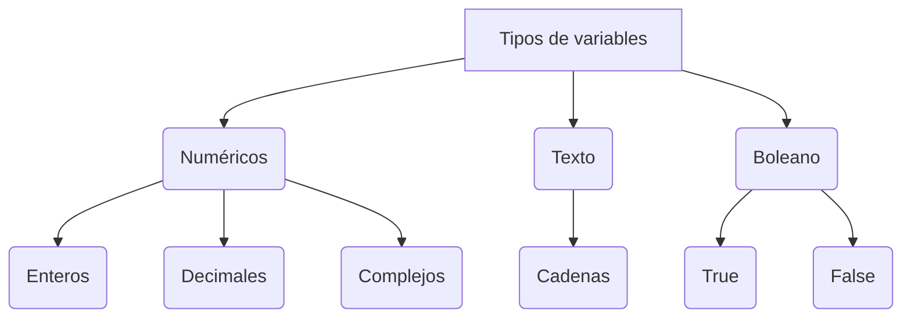
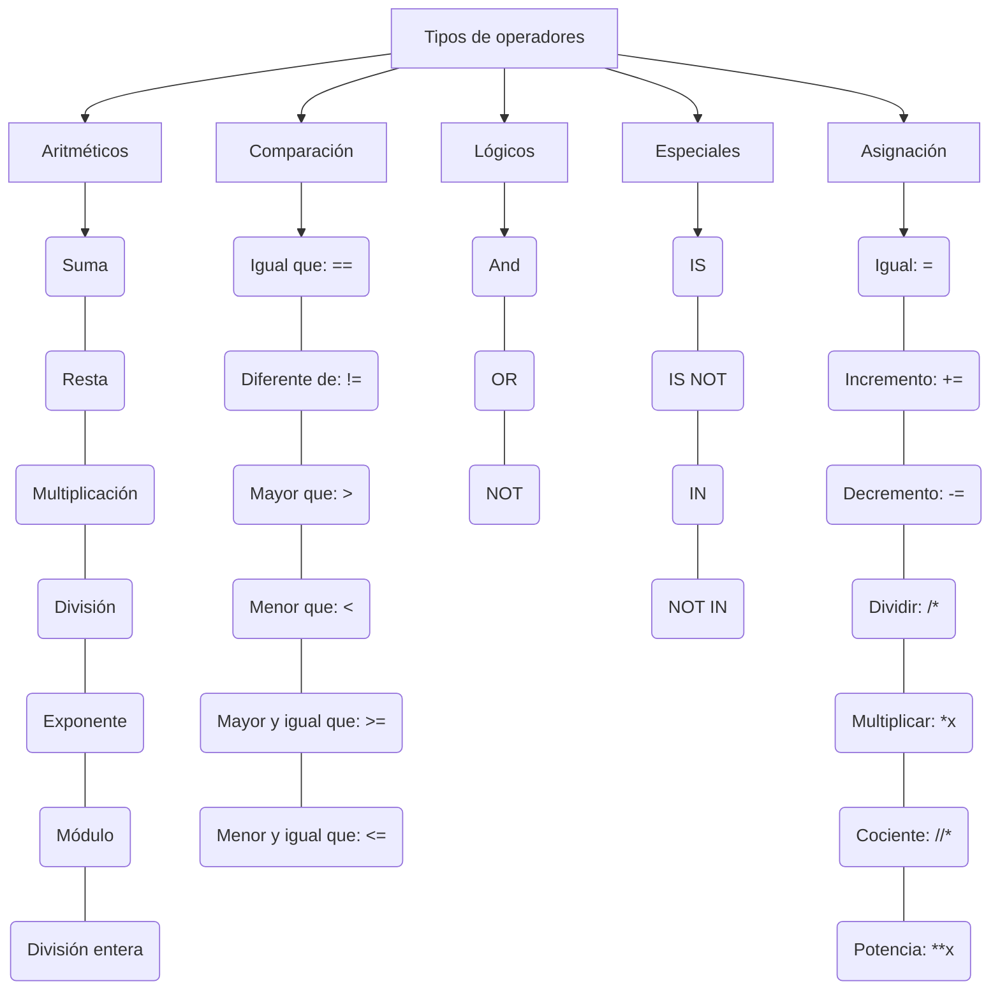

## *Programación en Python:*

A diferencia de markdown, que solo ayuda a la legibilidad de un texto, Python puede hacer otro tipo de operaciones ya que se usa para programar.

### Tipos de lenguaje:


- *Lenguaje de alto nivel:* Es aquel que se parece más al lenguaje humano. Sobretodo en la sintaxis.
- *Lenguaje de bajo nivel:* Es aquel que está formado por números.

### Tipos de tipado:

- *Tipado fuerte:* Es aquel que diferencia claramente los tipos de variables.
- *Tipado dinámico:* En este tipado la diferenciación se hace sobre la marcha.
                     Se asigna el tipo cuando se define el valor.


```
Qué son las librerías?

Es donde se guardan programas auxiliares
```

## *En Python:*

`#: Es un comentario. Es Utilizado para comentar lo que hacemos`


`\: Se usa para continuar la línea abajo ya que una misma instrucción puede estar dividida en varias líneas.`

### Identación:

Se usa para mover algo a la derecha para indicar que forma parte del bloque anterior.
Se puede usar el tabulador o 4 espacios.


----





---





---


### **VARIABLE:**

Es el espacio en la memoria del ordenador dónde se almacenará un valor que podrá cambiar durante la ejecución del programa.

*Cortesía*: Consiste en asignar a la variable un nombre que siempre empiece por minúscula. Puede llevar un número pero no empezar por él. 
            Se deben usar serpientes, es decir, barras bajas.
            
El valor está determinado por el contenido, no por el contenedor
