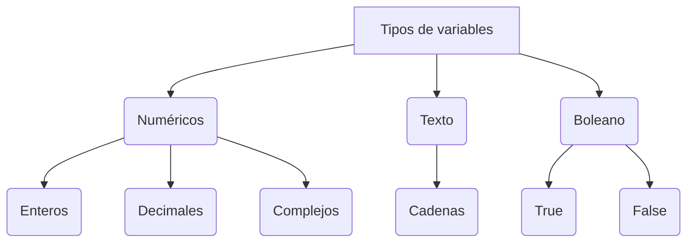
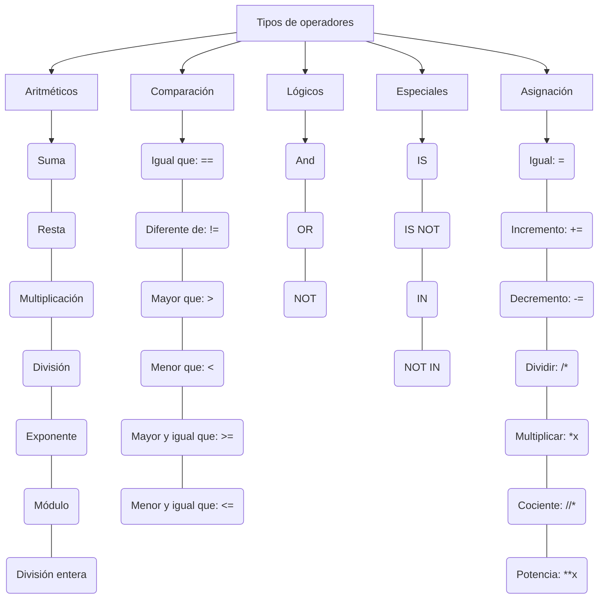

## *Programación en Python:*

A diferencia de markdown, que solo ayuda a la legibilidad de un texto, Python puede hacer otro tipo de operaciones ya que se usa para programar.

### Tipos de lenguaje:


- *Lenguaje de alto nivel:* Es aquel que se parece más al lenguaje humano. Sobretodo en la sintaxis.
- *Lenguaje de bajo nivel:* Es aquel que está formado por números.

### Tipos de tipado:

- *Tipado fuerte:* Es aquel que diferencia claramente los tipos de variables.
- *Tipado dinámico:* En este tipado la diferenciación se hace sobre la marcha.
                     Se asigna el tipo cuando se define el valor.


```
Qué son las librerías?

Es donde se guardan programas auxiliares
```

## *En Python:*

`#: Es un comentario. Es Utilizado para comentar lo que hacemos`


`\: Se usa para continuar la línea abajo ya que una misma instrucción puede estar dividida en varias líneas.`

### Identación:

Se usa para mover algo a la derecha para indicar que forma parte del bloque anterior.
Se puede usar el tabulador o 4 espacios.


----





---





---


### **VARIABLE:**

Es el espacio en la memoria del ordenador dónde se almacenará un valor que podrá cambiar durante la ejecución del programa.

*Cortesía*: Consiste en asignar a la variable un nombre que siempre empiece por minúscula. Puede llevar un número pero no empezar por él. 
            Se deben usar serpientes, es decir, barras bajas.
            
El valor está determinado por el contenido, no por el contenedor


```
"número = 5"

"número" es el contenedor y "5" es el contenido
```


Para que nos diga el tipo debemos usar:

`print type (nombre)`


### **FUNCIONES:**

Son un conxunto de lineas de código agrupadas que funcionan como unha unidad realizando unha tarea específica.
Pueden devolver valores ou non e poden ter parámetros ou non.

En *POO* (Programación Orientada a Objeto) se llaman métodos.
Una función de un objeto, en realidad, es un método. Primero se definen y después se les llama, por lo tanto tienen nombre

Una función es un objeto que en realidad puede ser un método. Primero se definen y después se les llama, por lo tanto tienen nombre.

#### *Sintaxis:*

```
def nombre_función(parámetros):
  instrucións da función
  return (opcional)
```
La primera línea es la declaración de la función, y el código que forma parte de esta debe ir identado.

#### *Ejecución:*
Consiste en llamar a la función

Si la función no recibe parámetros:
`nombre_función()`

Si los recibe:
`nombre_funición(parámetros)`


El **flujo de ejecución** de un programa siempre va de arriba a abajo excepto si se encuentra con funciones y bucles. 


### **LISTAS:**

Estructuras de datos que nos permiten almacenar grandes cantidad de valores. (Equivalente a los array en otros lenguajes de programación).
En Python las listas pueden guardas varios tipos de valores.
Se pueden expandir dinámicamente añadiendo nuevos elementos. De esta manera las listas se pueden ampliar (es una novedad en cuanto a otros lenguajes).

#### *Sintaxis:*
`nombreLista= [elem1, elem2, elem3, ...]`

La posición del elemento dentro de la lista es el índice. Este empieza en "0"
Cuando queremos imprimir la lista entera, la sintaxis sería la siguiente:

`print(miLista[:])`

Cuando queremos acceder a un elemento en concreto habría que escribir el índice de este elemento.

`print(miLista[<un número>])`

### *Métodos de listas:*
Un método es una función dentro de un objeto.
El método
`append`
agrega elementos a la lista.

```
miLista.append("<elem>")
```

Si queremos agregar el elemento en un lugar específico debemos utilizar `insert`.

```
miLista.insert(<índice>,<elem>)
```

`extend` se utiliza para agregar otra lista, no nuevos elementos.

```
miLista.extend(["<elem>","<elem>","<elem>"])
```

Utilizamos `index` para saber el índice de algún elemento.

```
print(miLista.index(“<elem>”))
```

### *Funciones:*

- `in` es una función interna. Se usa para saber si hay o buscar algún elemento en la lista.
- `remove` se usa para borrar un elemento de la lista.
- `pop` se usa para eliminar el último elemento de una lista.

#### *Operadores:*

Con el operador (+) **suma** se pueden unir listas. Es el “catenador” o “cat”.
Con el operador (*) **multiplicación**  podemos repetir la lista la cantidad de veces por las que la multipliquemos.


### **ESTRUCTURAS DE CONTROL DE FLUJO:**

El flujo de ejecución de un programa es el **orden** en el que se ejecutan sus instrucciones.
En Python, normalmente, el orden normal es de arriba abajo. Pero hay estructuras de control de fujo que modifican las instrucciones.

Las estructuras condicionales pueden romper este flujo.

-  #### *Condicionales:*

Las condiciones a evaluar dan como resultado verdadero (true) o falso (false). Si la condición es verdadera se ejecutan los bloques identados dentro del IF, si es falsa, el resto de instrucciones no se ejecutan, por lo que se rompe el flujo normal. Después se continua haciendo el resto de instrucciones.

  #### *Sintaxis:*

```
if <condición>
  *identación*
```

--------------------------------------------------

- En Python existe la función `input`, que es predefinida y sirve para introducir datos por el teclado. Lo que recibe lo convierte en datos de texto.
- `int(_)` transforma en entero los distintos parámetros.

---------------------------------------------------

**Ámbito de una variable:** La parte del programa desde donde es accesible la variable. Si una variable es global es accesible en todo el programa.

`else` (y si no es verdad) se ejecuta cuando la condición da como resultado falso. Se usa para ejecutar un código sin que sea una condición. Siempre es compañero del if más cercano.


En los condicionales podemos usar operadores boleanos: *or* (+), *and*(x) o *not*
El resultado puede ser verdadero o falso.

 #### AND
a x b  | S
-------|---
0 x 0  | 0
0 x 1  | 0
1 x 0  | 0
1 x 1  | 1

#### OR
a + b  | S
-------|---
0 + 0  | 0
0 + 1  | 1
1 + 0  | 1
1 + 1  | 1

#### NOT
a | S
--|---
0 | 1
1 | 0

-------------

En los condicionales también podemos usar el comando `in`. Este sirve para comprobar si una palabra está dento de una secuencia.

### **BUCLES:**

Los bucles pueden ser:

- Determinados: Sabemos el número de veces que se ejecutan.
- Indeterminados: No se sabe cuantas veces se va a ejecutar.

Cuando se entra en bucle el programa no avanza hasta que se salga de él.

#### **Sintaxis:**

```
for <variable> in <elem a recorrer>
```
El elemento a recorrer puede ser una lista, un rango o una tupla.

Cuando el elemento a iterar es una cadena de texto, la variable vale los caracteres. Si es una lista o tupla vale los elementos de la lista por orden.

#### *Range:*

Los elementos a recorrer de tipo rango aparecen con la función `range ()`
A la función se le pasa un parámetro, y la función range() devuelve una lista de números enteros, empezando por el 0 y siguiendo según el número de elementos que se le hayan pasado al parámetro.

Si se pasan 2 parámetros devuelve una cantidad de números enteros, que es la diferencia entre los dos. Se empieza por el pequeño.

La función `print()` es formateable, para eso ponemos dentro del paréntesis la letra "f" , y a partir de entonces podemos usar variables dentro de cadenas de texto con sustitución poniéndola entre corchetes.

```
i = "perico"
  print (f"buenos días")
```

Hay que crear una función que devuelva el valor de las vocales que tiene ese textos.

#### *While:*

Ejecuta todo el cuerpo y vuelve a mirar la condición para ver si es verdadero.
Es un bucle infinito.
Su problema es que se podría seguir ejecutando siempre:

```
**While: True**
```
Para salir del bucle se usa el comando 'break'

- 'continue': Sirve para que el bucle pase a la siguiente iteración.
- 'pass': Devuelve un null, es decir, no ejecuta. Se emplea para que no se de un error en python al faltar información en los distintos bucles.
- 'else': Se utiliza para lo mismo que un if

### **TUPLAS:**

#### *Características:*

- Listas inmutables: No se pueden cambiar después de su creación.
- Más rápidas.
- Ocupan menos memoria.
- No permiten búsquedas ya que no tienen índice.
- Formatean strings

A diferencia de las listas, estas pueden usarse como claves en diccionarios.

#### *Sintaxis:*

```
<nombreTupla>=(<elem1>, <elem2>, elem3,...)
```

El comando reservado `list` me da como resultado una lista de una tupla.
La palabra reservada `tuple` devuelve una tupla de una lista.

`in`: Nos permite comprobar si hay elementos dentro.

`count`: Cuenta los elementos dentro de una tupla.

```
<nombretupla>.count(elemento a contar)
```
La función `len` nos devuelve la longitud de la tupla.

Si algo va después de un punto es un **método**, si va después de un paréntesis es una **función**.

Una **tupla unitaria** dice el tipo de lo que se le ponga (tipado dinámico).

## **DICCIONARIOS:**

- Son estructuras de datos que nos permite almacenar valores de diferente tipo (enteros, cadenas de texto, decimales) e incluso listas y otros diccionarios.
- La principal Característica de los diccionarios es que los datos se almacenan asociados a una clave de tal forma que se crea una asociación de tipo 'clave: valor' para cada elemento almacenado.
- Los elementos almacenados no están ordenados. El orden es indiferente a la hora de almacenar ingormación en un diccionario.

## **GENERADORES:**

Son estructuras que extraen valores de una función y se almacenan en objetos *iterables* (que se pueden recorrer). Los valores se almacenan de uno en uno.
Cada vez que se almacena un valor, este permanece en un estado pausado hasta que se solicita el siguiente. A esta característica se le conoce como *suspensión de estado*.
   
   - ** Función tradicional**: Def generaNúmeros():
                                     return números.
   - **Generador**: Def generaNumeros():         
                           yield numeros


